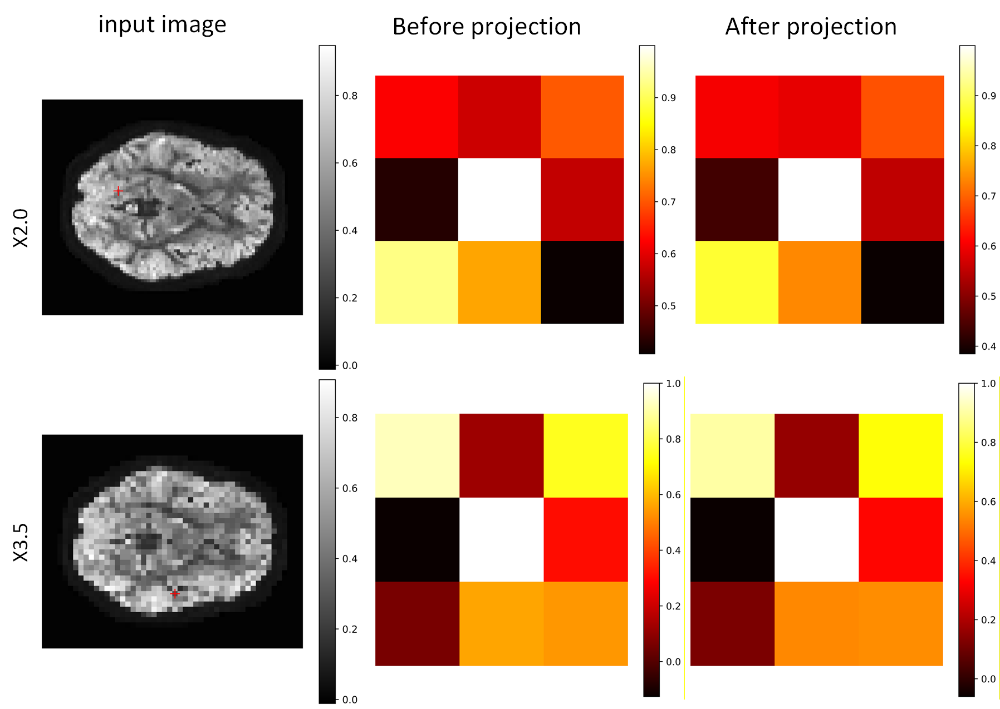
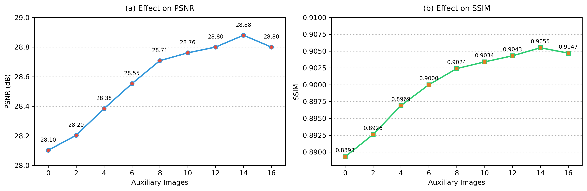
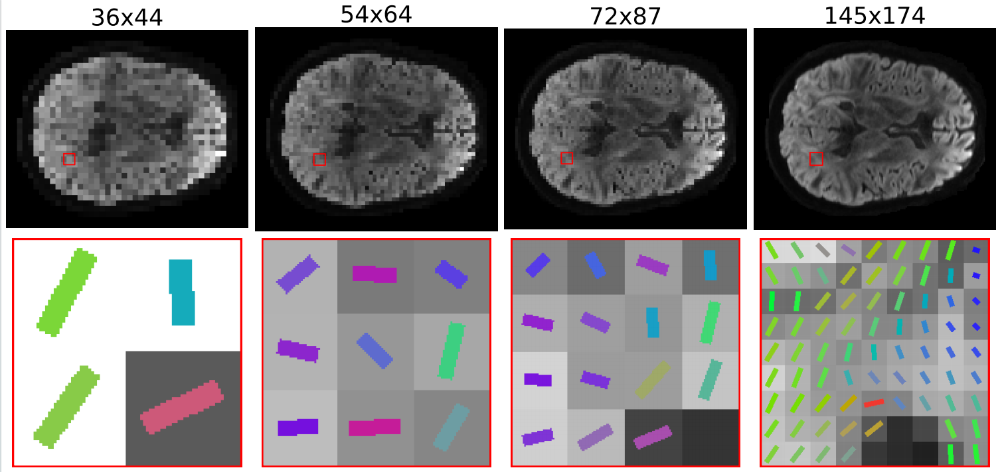

# PSD-INR
## Validation of the orthogonal projection

  

In the above figure, features A and B are obtained from images A and B via the RDN encoder, respectively. By orthogonally projecting feature A onto feature B, we can extract the redundant information that is shared between features A and B. Subtracting this projected component from feature A yields the unique information of feature A. As shown, the independence of feature A is significantly enhanced.

  

Additionally, in the above figure，we select features at a specific point in the image at scales ×2.0 and ×3.5, and compute the cosine similarity between this point’s feature and its eight neighboring features, both before and after orthogonal projection. The results show a clear decrease in similarity after projection, demonstrating that orthogonal projection effectively removes auxiliary-direction–related features, thereby enhancing the independence of the target-direction features. The enhanced target-direction features in turn improve the representational capacity of the INR.

## sensitivity to the number of auxiliary directions
The diffusion MRI data used in our experiments are obtained from the Human Connectome Project (HCP), where diffusion gradient directions are accurately calibrated,therefore, the issue of inaccurate diffusion gradient directions does not arise in our experimental setup.

we further demonstrate that the proposed network achieves optimal performance when incorporating 14 auxiliary diffusion directions, and all quantitative results reported in the paper correspond to this best-performing setting.

  

##  fibers dirtion across different spatial scales

  

  

  

  

